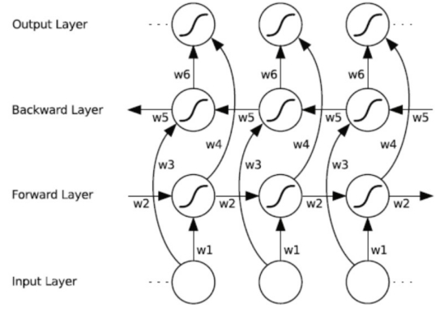
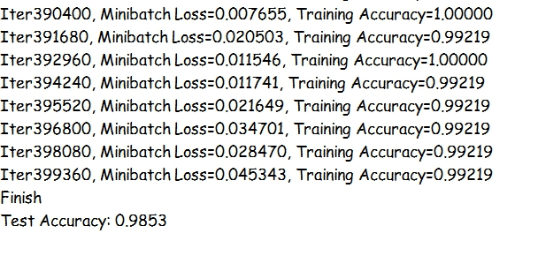

## **基于Visual Studio Tools for AI的TensorFlow编程实现Bi-RNN双向循环神经网络**

### **1.背景介绍**

双向循环神经网络(Bi-directional Recurrent Neural Networks)于1997年，即与LSTM在同一年被Schuster和Paliwal提出，传统的RNN不会利用未来的上下文信息进行预测，例如看下面的一句古诗：‘忽如一夜__来，千树万树梨花开’，如果只看前半句话，那么相信谁都没有思路能把空填上，但当我们往后看一句话时，我们会知道，哦，梨花开了，春天来了，所以前面会填‘春风’。当用传统RNN来做预测时，传统的RNN并不会利用到历史输入的未来信息，而Bi-RNN做到了这一点，Bi-RNN会同时利用历史和未来数据来进行预测，实现的原理只需将两个相反的循环神经网络连接在一起即可，这样就会同时使用历史和未来信息，这种结构经常用于机器翻译中，本节我们利用上节所学习到的LSTM与本节所介绍的Bi-RNN来搭建Bi-LSTM , Bi-LSTM的结构与Bi-RNN类似，只需将其中的RNN单元替换为LSTM即可。


### **2.相关技术简介**

#### **1.Bi-RNN的结构是什么?**

我们照例先贴上一张图。

 

上图与我们所知道的RNN的结构很相似，在Bi-RNN中，我们分别建立起顺时RNN与逆时RNN，这两个RNN之间是完全独立的，中间并不存在直接关联，这样每个输出都会同时利用正反两个方向上的信息，输出层直到两个RNN层处理完所有的输入序列之后才会进行更新。那么，我们该如何对Bi-RNN进行训练呢?在这里我们依然使用BPTT算法，但是state在各自方向的开始处是未知的，这里需要我们进行人工的设置，在反向传播时，正向state在t=T时的导数未知，且反向state在t=1时的导数未知，这里我们需要设置为0代表此时对参数更新不重要，接下来进行前馈计算，首先计算1-t的正向state，接下来计算t-1的反向state，最后获得最终的输出，在反馈计算时，我们先对output求导，接下来沿着T-1计算正向RNN的导数，再计算1-T反向RNN的导数，然后更新梯度，这样就完成了一次训练。


### **3. 实验目标**

利用TensorFlow平台来实现Bi-LSTM神经网络，并在MNIST数据集上测试网络的性能


### **4.** **实验步骤**

本次实验我们分为三个步骤:

* 载入所需要的库并预定义操作

* 构建神经网络

* 评价神经网络的性能

(本节代码主要来源于TensorFlow的开源实现)

首先我们载入本次实验所需要的库以及MNIST数据集，同样采用one_hot编码，设置学习速率为0.01，最大样本数量为400000，每个batch含有的样本数量为128，同时每间隔10步显示一次训练情况。图像识别在循环神经网络中是以图像的一行像素点作为输入，那么神经网络的迭代次数即为图像的高，因此，在这里我们设置每次输入的宽度为28，迭代次数(即为图像的高)为28，隐藏节点的数量设置为256，最终输出的分类数为10。

```
import tensorflow as tf
import numpy as np
from tensorflow.examples.tutorials.mnist import input_data


mnist = input_data.read_data_sets('../CNN/MNIST_data/', one_hot=True)

learning_rate = 0.01
max_samples = 400000
batch_size = 128
display_step =  10

#宽度*迭代次数
n_inputs = 28
n_steps = 28
n_hidden = 256
n_classes = 10
```

接下来我们定义images的输入x和labels的输入y，这里我们要将x的输入变为三个维度，第一个维度是样本数量，第二个维度是样本的宽作为输入，第三个维度是样本的高作为迭代次数，接下来我们定义输出层的权重weights和偏置bias,在这里要注意由于隐藏层有两个方向的输出(正向&反向)，所以参数量要*2。

```
x = tf.placeholder(tf.float32, [None, n_inputs*n_steps])
x_conv = tf.reshape(x, [-1, n_inputs, n_steps])
y = tf.placeholder(tf.float32, [None,n_classes])

#双向LSTM参数量加倍
weights = tf.Variable(tf.truncated_normal([2*n_hidden, n_classes], stddev=0.01))
bias = tf.Variable(tf.constant(0.1, shape=[n_classes]))
```

接下来定义Bi-LSTM网络，我们先转换x的维度以匹配接下来训练的输入，首先使用tf.transpose来进行tenosr维度的转换，例如x = tf.transpose(x, [1,0,2])是将tensor的第一个维度和第二个维度进行交换，新得到的x维度为(n_steps, batch_size, n_inputs)，之后将x维度转换为(n_steps*batch_size，n_inputs)，最后使用tf.split将x拆分成长度为n_steps的列表，该列表内的每个tensor的长度为(batch_size, n_inputs)，这样就匹配了LSTM单元的输入格式(如果觉得上述内容有些麻烦只关注最后一句话就好。。。)。

```
def BiRNN(x, weights, bias):
    x = tf.transpose(x, [1,0,2])
    x = tf.reshape(x, [-1, n_inputs])
    x = tf.split(x, n_steps)
```

定义好输入之后，接下来我们定义正向与反向的LSTM单元，之后使用tf.contrib.rnn.static_bidirectional_rnn将刚才定义的LSTM单元添加到Bi-RNN中，最后乘以权重加以偏置作为输出层返回。

```
    lstm_fw_cell = tf.contrib.rnn.BasicLSTMCell(n_hidden, forget_bias=1.0)
    lstm_bw_cell = tf.contrib.rnn.BasicLSTMCell(n_hidden, forget_bias=1.0)
   
    outputs, _ , _ = tf.contrib.rnn.static_bidirectional_rnn(lstm_fw_cell, lstm_bw_cell, x, dtype=tf.float32)
    return tf.matmul(outputs[-1], weights) + bias
```

接下来定义损失函数与优化器，这里与我们之前定义过的损失函数的方法一样，因此在这里不做太多叙述，同时我们使用Adam(Adaptive moment estimation)自适应矩估计算法进行优化，该算法可以根据每个参数的一阶矩估计和二阶矩估计来动态调整学习率，如果对这个算法有兴趣可以自行查阅一下相关资料。

```
pred = BiRNN(x_conv, weights, bias)
cost = tf.reduce_mean(tf.nn.softmax_cross_entropy_with_logits(labels=y, logits=pred))
optimizer = tf.train.AdamOptimizer(learning_rate=learning_rate).minimize(cost)
accuracy = tf.reduce_mean(tf.cast(tf.equal(tf.argmax(pred,1), tf.argmax(y,1)), dtype=tf.float32))
```

最后我们开始训练，并每隔display_step次进行一次loss与正确率的输出，最后在测试集上输出正确率。

```
with tf.Session() as sess:
    tf.global_variables_initializer().run()
    step = 1
    print('开始训练')
    while step*batch_size < max_samples:
        batch_x, batch_y = mnist.train.next_batch(batch_size)
       # batch_x = tf.reshape(batch_x, [batch_size, n_steps, n_inputs])
        optimizer.run({x:batch_x, y:batch_y})
        if step % display_step == 0:
            loss = cost.eval({x:batch_x, y:batch_y})
            acc = accuracy.eval({x:batch_x, y:batch_y})
            print('Iter'+ str(step*batch_size)+', Minibatch Loss=' + '{:.6f}'.format(loss) + ', Training Accuracy=' + '{:.5f}'.format(acc))
        step += 1
    print('Finish')
    
    test_len = 10000
    test_data = mnist.test.images[:test_len]
    test_label = mnist.test.labels[:test_len]
    
    print('Test Accuracy:', accuracy.eval({x:test_data, y:test_label}))
```


### **5.** **实验结论**

实验结果如下所示:

 

我们发现Bi-RNN在MNIST测试数据集上的准确率很高，但是在图像识别领域中相对于卷积神经网络还是稍显不足，但是在对序列数据进行分处理时，Bi-RNN就显示出了它强大的时序处理能力，为RNN的发展推进了一大步。
